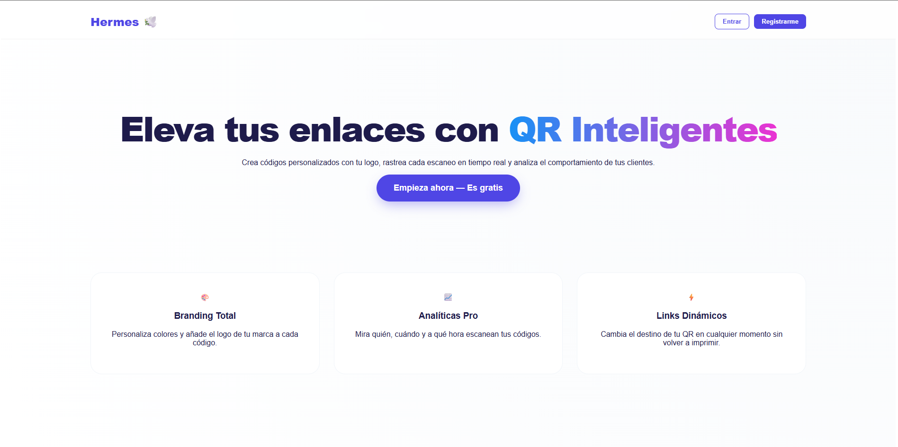
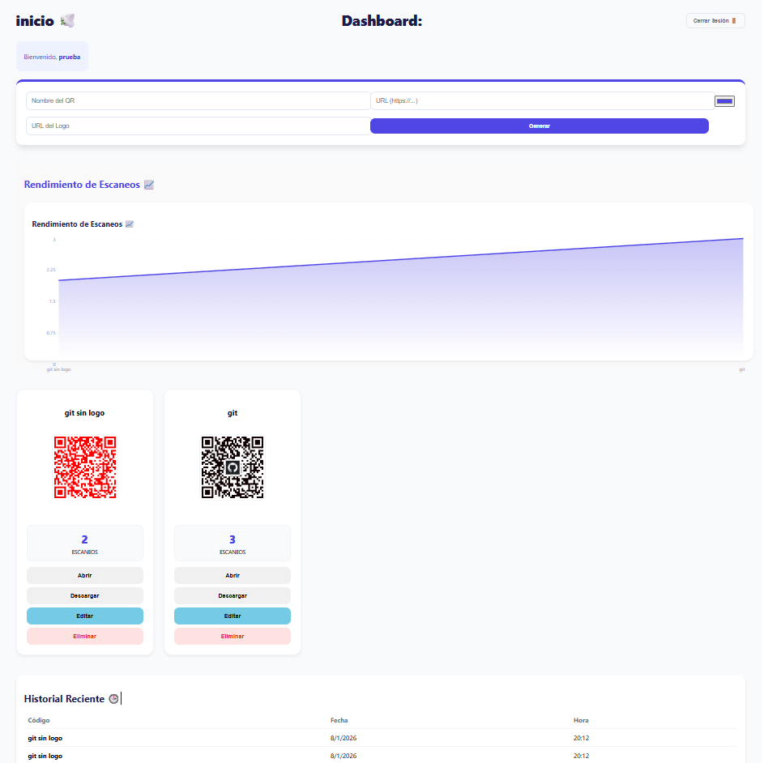

🇺🇸 English | [🇪🇸 Español](README_ES.md)
# 🕊️ Hermes — Plataforma de Gestión de QRs Dinámicos y Analíticas Pro

### 📌 General Description
Hermes is a **Full Stack (MERN)** solution designed for the creation, customization, and metric tracking of QR codes.

Unlike a simple generator, Hermes offers an **administrative ecosystem** that allows understanding user behavior in real-time, optimizing link management through precise data.

---

### 🎥 Demo in Action

[](https://www.youtube.com/watch?v=nkdPb_nGdgo)

*Click on the image to watch the full demonstration: Landing, Login, and the QR generation flow with analytics.*

---

### 🚀 Main Features

* **🎨 Personalized Branding:** QR generation with logo insertion, transparency handling, and color customization.
* **📈 Analytics Dashboard:** Data visualization through performance graphs showing scan flow per code.
* **🕒 Activity History:** Audit table with exact registration of date and time of each interaction.
* **💾 Professional Export:** Canvas rendering logic for high-quality PNG downloads.
* **🔐 High-Grade Security:** Robust authentication based on **JWT (JSON Web Tokens)** and route protection on the Front-end.

---

### 📸 Screenshots

| Landing Page | Dashboard Principal |
| :---: | :---: |
|  |  |

---

### 🧠 Demonstrated Skills

* **Full Stack Architecture:** Complete development using MongoDB, Express, React, and Node.js.
* **Database Management:** Model design for event tracking and user relationships.
* **Information Visualization:** Transformation of raw metrics into interactive visual components.
* **Security and UX:** Implementation of secure access flows and clean, modern interface design.

---

### 🛠️ Technologies

**Frontend:** React.js (Vite), Recharts, CSS Modules, Html2Canvas.  
**Backend:** Node.js, Express, MongoDB, JWT, Bcrypt.

---

### ⚙️ Configuration and Deployment

1. **Clone the repository**
   ```bash
   git clone [https://github.com/tu-usuario/hermes-qr.git](https://github.com/tu-usuario/hermes-qr.git)
Server (Backend)

Enter the server folder: cd server

Install dependencies: npm install

IMPORTANT: Create a .env file in the root of the server folder with:

Fragmento de código

PORT=5000
MONGO_URI=tu_conexion_a_mongodb

Start the server: npm run dev

Client (Frontend)

Enter the client folder: cd client

Install dependencies: npm install

Start the application: npm run dev

🧑‍💻 Autor
Sebastian Murillo Software Engineer | Full Stack Developer | AI & Data